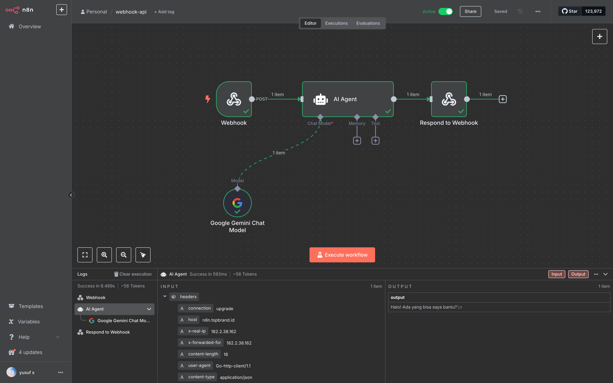

# Web App Chatbot

A real-time chat application with a Go backend and Astro frontend that connects to n8n for workflow automation.

## n8n configuration



## Project Structure

```
├── backend/         # Go/Fiber backend with WebSocket support
└── frontend/        # Astro frontend with React components
```

## Features

- Real-time chat using WebSockets
- Fallback to HTTP requests when WebSockets are unavailable
- Integration with n8n for workflow automation
- Modern UI with Tailwind CSS
- Responsive design for all devices

## Prerequisites

- Go 1.24.5 or later
- Node.js 18 or later
- npm or yarn
- n8n instance (self-hosted or cloud)

## Getting Started

### Backend Setup

1. Navigate to the backend directory:
   ```bash
   cd backend
   ```

2. Install dependencies:
   ```bash
   go mod tidy
   ```

3. Update the n8n webhook URL in `main.go`

4. Run the backend server:
   ```bash
   go run main.go
   ```

### Frontend Setup

1. Navigate to the frontend directory:
   ```bash
   cd frontend
   ```

2. Install dependencies:
   ```bash
   npm install
   ```

3. Start the development server:
   ```bash
   npm run dev
   ```

4. Access the application at `http://localhost:4321`

## n8n Integration

1. Set up an n8n instance
2. Create a webhook node as the trigger
3. Configure the webhook to receive messages from the chatbot
4. Process the messages and return responses in the format: `{ "reply": "Bot response here" }`

## Deployment

### Backend

```bash
cd backend
go build -o chatbot-server
./chatbot-server
```

### Frontend

```bash
cd frontend
npm run build
# Deploy the dist directory to your hosting provider
```

## License

MIT


## Architecture

```
+----------------+     +----------------+     +----------------+
|                |     |                |     |                |
|  Astro         |     |  Go/Fiber      |     |  n8n           |
|  Frontend      +---->+  Backend       +---->+  Workflow      |
|                |     |                |     |                |
+----------------+     +----------------+     +----------------+
```